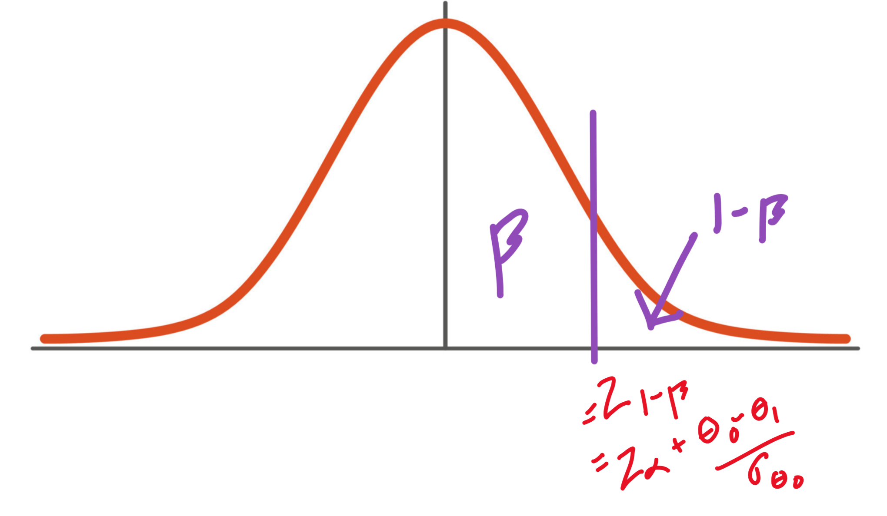

# Type II Error Probabilities and Finding the Sample Size for Z-Tests


## Type II Error Rate
* Occurs when we fail to reject $H_{0}$ when $H_{0}$ is false
* Probability of Type II Error
```math
\begin{align*}
\beta &= P(\text{Type II Error})\\
&= P(\text{fail to reject } H_{0} \, \vert \, \theta \in H_{\alpha}) \\
&= P(TS \not\in RR \, \vert \, \theta \in H_{\alpha})  \\
&= P(\text{fail to reject } H_{0} \, \vert \, H_{0} \text{ is false}) \\
&= P(TS \not\in RR \, \vert H_{0} \text{ is false})  \\
\end{align*}
```

* For different true values of $\theta = \theta_{1}, \beta$ is different
    * Distribtuion of TS are different

* $\beta$ is NOT a single value, depends on true value $\theta$. 
    * More appropiate to depict $\beta$ as a function of $\theta$
* Alternative Hypothesis possible cases
    * $H_{\alpha}: \theta > \theta_{0}$
    * $H_{\alpha}: \theta < \theta_{0}$
    * $H_{\alpha}: \theta \neq \theta_{0}$

## $\beta$ for testing $\mu, \mu_{1} - \mu_{2}$ 

### Case 1: $H_{\alpha}: \theta > \theta_{0}$
Then RR= $\{ TS > z_{\alpha} \}$ with $TS = \frac{\hat{\theta} - \theta_{0}}{\sigma_{\hat{\theta}}}$

```math
\begin{align*}
\beta( \theta_{1})
&= P(TS \leq z_{\alpha} \vert \theta = \theta_{1}) \\
&= P \bigg(\frac{\hat{\theta} - \theta_{0}}{\sigma_{\hat{\theta}}} \leq z_{\alpha} \bigg\vert \theta = \theta_{1} \bigg) \\
&= P \bigg(\frac{\hat{\theta} - \theta_{0}}{\sigma_{\hat{\theta}}} + \frac{\theta_{0} - \theta_{1}}{\sigma_{\hat{\theta}}} \leq z_{\alpha}  + \frac{\theta_{0} - \theta_{1}}{\sigma_{\hat{\theta}}} \bigg\vert \theta = \theta_{1} \bigg) \\
&= P \bigg(\frac{\hat{\theta} - \theta_{1}}{\sigma_{\hat{\theta}}}  \leq z_{\alpha}  + \frac{\theta_{0} - \theta_{1}}{\sigma_{\hat{\theta}}} \bigg\vert \theta = \theta_{1} \bigg) \\
&= \Phi \bigg(z_{\alpha} + \frac{\theta_{0} - \theta_{1}}{\sigma_{\hat{\theta}}} \bigg)
\end{align*}
```
> $\Phi(\cdot)$ is the CDF of $\mathcal{N}(0,1)$

> Note $TS = \frac{\hat{\theta} - \theta_{1}}{\sigma_{\hat{\theta}}}$ no longer has a $\mathcal{N}(0,1)$ 

> The bigger $\theta_{1}$ is, the smaller $\beta$ is
### Case 2: $H_{\alpha}: \theta < \theta_{0}$

Then RR = $\{  TS < -z_{\alpha}\}$ where $TS = \frac{\hat{\theta}- \theta_{0}}{\sigma_{\hat{\theta}}}$

```math

\begin{align*}
\beta(\theta_{1})
&= P(TS \geq -z_{\alpha} \vert \theta = \theta_{1}) \\
&= P \bigg( \frac{\hat{\theta} - \theta_{0}}{\sigma_{\hat{\theta}}} \geq -z_{\alpha}  \bigg\vert \theta = \theta_{1}) \\
&= P \bigg( \frac{\hat{\theta} - \theta_{0}}{\sigma_{\hat{\theta}}} + \frac{\theta_{0} - \theta_{1}}{\sigma_{\hat{\theta}}}\geq
             -z_{\alpha} + \frac{\theta_{0} - \theta_{1}}{\sigma_{\hat{\theta}}} \bigg\vert \theta = \theta_{1} \bigg) \\
&= P \bigg( \frac{\hat{\theta} - \theta_{1}}{\sigma_{\hat{\theta}}} \geq
             -z_{\alpha} + \frac{\theta_{0} - \theta_{1}}{\sigma_{\hat{\theta}}} \bigg\vert \theta = \theta_{1} \bigg) \\
&= 1- \Phi \bigg( -z_{\alpha} + \frac{\theta_{0} - \theta_{1}}{\sigma_{\hat{\theta}}} \bigg) \\
&= \Phi \bigg( z_{\alpha} - \frac{\theta_{0} - \theta_{1}}{ \sigma_{\hat{\theta}}} \bigg)  
\end{align*}

```

> $\Phi(\cdot) $ is the CDF of $\mathcal{N}(0,1)$

> $\mathcal{N}(0,1)$ is symmetric across x-axis

> The smaller $\theta_{1}$ is, the smaller $\beta$ is

### Case 3: $H_{\alpha}: \theta \neq \theta_{0}$

Then RR $:= \{ | TS | > z_{ \frac{\alpha}{2}} \}$ with $TS = \frac{\hat{\theta} - \theta_{0}}{\sigma_{\hat{\theta}}}$

```math
\begin{align*}
\beta(\theta_{1}) 
&= P \bigg( |TS| \leq z_{\frac{\alpha}{2}} \vert \theta = \theta_{1} \bigg) \\
&= P \bigg( -z_{\frac{\alpha}{2}} \leq  \frac{\hat{\theta} - \theta_{0}}{\sigma_{\hat{\theta}}} \leq z_{\frac{\alpha}{2}} \bigg\vert \theta = \theta_{1} \bigg)\\
&= P \bigg( 
        -z_{\frac{\alpha}{2}} + \frac{\theta_{0} - \theta_{1}}{\sigma_{\hat{\theta}}} \leq  
        \frac{\hat{\theta} - \theta_{0}}{\sigma_{\hat{\theta}}} + \frac{\theta_{0} - \theta_{1}}{\sigma_{\hat{\theta}}}\leq 
        z_{\frac{\alpha}{2}} + \frac{\theta_{0} - \theta_{1}}{\sigma_{\hat{\theta}}}
            \bigg\vert \theta = \theta_{1} \bigg) \\
&= \Phi \bigg(z_{\frac{\alpha}{2}} + \frac{\theta_{0} - \theta_{1}}{\sigma_{\hat{\theta}}} \bigg) 
        - \Phi \bigg(  z_{\frac{\alpha}{2}} + \frac{\theta_{0} - \theta_{1}}{\sigma_{\hat{\theta}}}\bigg)
\end{align*}

```


> The bigger $\theta_{0} - \theta_{1}$ is, the smaller $\beta$ is

### Major Takeaway

* The further away $\theta_{1}$ is from $\theta_{0}$ along the direction of $H_{\alpha}$, the smaller $\beta$ is.
    * It is less likely to reject $H_{0} by mistake if the data deviates from $H_{0}$ more

## $\beta$ for testing $p$
* $H_{0}:  p = p_{0}$
* $TS = \frac{\hat{p} - p_{0}}{\sigma_{\hat{p}}} = \frac{\hat{p} - p_{0}}{\sqrt{\frac{p_{0} (1-p_{0})}{n}}}$
* Alternative Hypothesis
    * $H_{\alpha}: p < p_{0}$
    * $H_{\alpha}: p > p_{0}$
    * $H_{\alpha}: p \neq p_{0}$
### Notice:
When $H_{\alpha}(p = p_{1} \neq p_{0})$ is true
$$TS \sim \mathcal{N} \bigg(E(TS), SD(TS)^{2}\bigg)$$
* $$E(TS) 
    = E\bigg(\frac{\hat{p} - p_{0}}{\sqrt{\frac{p_{0} (1-p_{0})}{n}}} \bigg)
    = \frac{E(\hat{p}) - p_{0}}{\sqrt{\frac{p_{0} (1-p_{0})}{n}}}
    = \frac{p_{1} - p_{0}}{\sqrt{\frac{p_{0} (1-p_{0})}{n}}}
    $$
* $$ST(TS) 
    = \frac{SD(\hat{p} - p_{0})}{\sqrt{\frac{p_{0}(1-p_{0})}{n}}}
    = \frac{
            \sqrt{\frac{p_{1}- (1-p_{1})}{n}}
        }{
            \sqrt{\frac{p_{0} (1-p_{0})}{n}}
        } 
    = \sqrt{\frac{p_{1}(1-p_{1})}{p_{0}(1-p_{0})}}
    $$


-----
## Case 3: $H_{\alpha}:\theta \neq \theta_{0}$

$$
\beta(\theta_{1})= P(-z_{\frac{\alpha}{2}} \leq TS \leq z_{\frac{\alpha}{2}})
$$

$$
=P(TS\leq z_{\frac{\alpha}{2}})-P(TS\leq -z_{\frac{\alpha}{2}})
$$

$$
=P \Bigg({\frac{ {TS - \frac{p_{1}- p_{0}}{\sqrt{ \frac{p_{0}(1-p_{0})}{n} }}}}{\sqrt{\frac{p_{1}(1-p_{1})}{p_{0}(1-p_{0})}}}} \leq \frac{z_{\frac{\alpha}{2}} - \frac{p_{1}- p_{0}}{\sqrt{ \frac{p_{0}(1-p_{0})}{n} }}}{\sqrt{\frac{p_{1}(1-p_{1})}{p_{0}(1-p_{0})}}} \Bigg) - \Bigg( \frac{ {TS - \frac{p_{1}- p_{0}}{\sqrt{ \frac{p_{0}(1-p_{0})}{n} }}}}{\sqrt{\frac{p_{1}(1-p_{1})}{p_{0}(1-p_{0})}}} \leq \frac{-z_{\frac{\alpha}{2}} - \frac{p_{1}- p_{0}}{\sqrt{ \frac{p_{0}(1-p_{0})}{n} }}}{\sqrt{\frac{p_{1}(1-p_{1})}{p_{0}(1-p_{0})}}} \Bigg) \\
$$

$$
= \Phi \Bigg(\frac{z_{\frac{\alpha}{2}} + \frac{p_{0}- p_{1}}{\sqrt{ \frac{p_{0}(1-p_{0})}{n} }}}{\sqrt{\frac{p_{1}(1-p_{1})}{p_{0}(1-p_{0})}}} \Bigg)- \Phi \Bigg(\frac{-z_{\frac{\alpha}{2}} + \frac{p_{0}- p_{1}}{\sqrt{ \frac{p_{0}(1-p_{0})}{n} }}}{\sqrt{\frac{p_{1}(1-p_{1})}{p_{0}(1-p_{0})}}} \Bigg)
$$

$$
 \Phi\Bigg(\frac{z_{\alpha/2}}{\sqrt{\frac{p_{1}(1-p_{1})}{p_{0}(1-p_{0})}}}+ \frac{p_{0} - p_{1}}{\sqrt{\frac{p_{1}(1-p_{1})}{n}}}\Bigg) -\Phi\Bigg(\frac{-z_{\alpha/2}}{\sqrt{\frac{p_{1}(1-p_{1})}{p_{0}(1-p_{0})}}}+\frac{p_{0}- p_{1}}{\sqrt{\frac{p_{1}(1-p_{1})}{n}}} \Bigg) 
$$


<!-- $$
\begin{align*}
\beta 
&= P(-z_{\frac{\alpha}{2}} \leq TS \leq z_{\frac{\alpha}{2}})\\
&= P(TS\leq z_{\frac{\alpha}{2}})-P(TS\leq -z_{\frac{\alpha}{2}}) \\
&= P
    \Bigg( 
        \underbrace{
            \frac{ {TS - \frac{p_{1}- p_{0}}{\sqrt{ \frac{p_{0}(1-p_{0})}{n} }}}}
            {\sqrt{\frac{p_{1}(1-p_{1})}{p_{0}(1-p_{0})}}}
        }_{\mathcal{N}(0,1)}
        \leq
        \frac{z_{\frac{\alpha}{2}} - \frac{p_{1}- p_{0}}{\sqrt{ \frac{p_{0}(1-p_{0})}{n} }}}
        {\sqrt{\frac{p_{1}(1-p_{1})}{p_{0}(1-p_{0})}}}
    \Bigg)
    -
    \Bigg( 
        \underbrace{
            \frac{ {TS - \frac{p_{1}- p_{0}}{\sqrt{ \frac{p_{0}(1-p_{0})}{n} }}}}
            {\sqrt{\frac{p_{1}(1-p_{1})}{p_{0}(1-p_{0})}}}
        }_{\mathcal{N}(0,1)}
        \leq
        \frac{-z_{\frac{\alpha}{2}} - \frac{p_{1}- p_{0}}{\sqrt{ \frac{p_{0}(1-p_{0})}{n} }}}
        {\sqrt{\frac{p_{1}(1-p_{1})}{p_{0}(1-p_{0})}}}
    \Bigg) \\
&= \Phi \Bigg( 
    \frac{z_{\frac{\alpha}{2}} + \frac{p_{0}- p_{1}}{\sqrt{ \frac{p_{0}(1-p_{0})}{n} }}}
        {\sqrt{\frac{p_{1}(1-p_{1})}{p_{0}(1-p_{0})}}}
    \Bigg)- 
    \Phi \Bigg( 
        \frac{-z_{\frac{\alpha}{2}} + \frac{p_{0}- p_{1}}{\sqrt{ \frac{p_{0}(1-p_{0})}{n} }}}
        {\sqrt{\frac{p_{1}(1-p_{1})}{p_{0}(1-p_{0})}}}
    \Bigg) \\
&= \Phi\Bigg( 
    \frac{z_{\alpha/2}}{\sqrt{\frac{p_{1}(1-p_{1})}{p_{0}(1-p_{0})}}}    
    +
    \frac{p_{0} - p_{1}}{\sqrt{\frac{p_{1}(1-p_{1})}{n}}}
    \Bigg)
    -
    \Phi\Bigg( 
        \frac{-z_{\alpha/2}}{\sqrt{\frac{p_{1}(1-p_{1})}{p_{0}(1-p_{0})}}}    
    +
    \frac{p_{0} - p_{1}}{\sqrt{\frac{p_{1}(1-p_{1})}{n}}}
    \Bigg)
\end{align*}
$$ -->

## Power of Hypothesis Test
 
$$
\begin{align*}
\text{Power}
&= P(\text{ Reject} H_{0} \,\vert H_{0} \text{ is false}) \\
&= 1- P(\text{ Fail to reject } H_{0} \, \vert  \theta = \theta_{1}) \\
&= 1 - \beta(\theta_{1})
\end{align*}
$$
* Probability of the correct decision (of rejection)
* Power of the test is also a function of the true value of the parameter $\theta_{1}$
* Quantifies how easy the designed test can prove a true research alternative hypothesis.
    * If a hypothesis test has power $0.98$, and the null hypothesis is indeed false, then it means that $98\%$ of the times, a typical sample collected form the target population will
    lead us to a correct decision of rejecting the null hypothesis
* Best way to increase power of a test is to increase sample size $n$

## Impact of $n$ on power when test $\mu, \mu_{1} - \mu_{2}$

### Case 1: $\theta > \theta_{0}$

$$\beta(\theta_{1}) =\Phi \bigg(z_{\alpha} + \frac{\theta_{0} - \theta_{1}}{\sigma_{\hat{\theta}}} \bigg)$$

$$ \text{Power}(\theta_{1}) = 1 - \beta(\theta_{1}) = 1 - \Phi \bigg(z_{\alpha} + \frac{\theta_{0} - \theta_{1}}{\sigma_{\hat{\theta}}} \bigg)$$

### Case 2: $\theta < \theta_{0}$

$$\beta(\theta_{1}) =\Phi \bigg(z_{\alpha} - \frac{\theta_{0} - \theta_{1}}{\sigma_{\hat{\theta}}} \bigg)$$

$$ \text{Power}(\theta_{1}) = 1 - \beta(\theta_{1}) = 1 - \Phi \bigg(z_{\alpha} - \frac{\theta_{0} - \theta_{1}}{\sigma_{\hat{\theta}}} \bigg)$$

* As sample size $n$ increases $\Rightarrow \sigma_{\hat{\theta}}$ decreases $\Rightarrow \beta(\theta_{1})$ decreases $\Rightarrow$ Power increases!


## Finding $n$ when given $\alpha, \beta$ 
* Real Life Limitations
    * If $H_{0}$ is true, then we want to minimize Type I Error
    * If $H_{0}$ is false, then we want to maximize the power of the tests
        * Want to reject $H_{0}$
    * Larger sample size is always better, but budget limitation of sample size

### Finding $n$ when testing $\mu, \mu_{1} - \mu_{2}$
#### Case 1: $H_{\alpha}: \theta > \theta_{0}$
$$
\begin{align*}
\beta &= \Phi \bigg( z_{\alpha} + \frac{\theta_{0} - \theta_{1}}{\sigma_{\hat{\theta}}} \bigg) \\
&\Rightarrow z_{1-\beta} = z_{\alpha} + \frac{\theta_{0} - \theta_{1}}{\sigma_{\hat{\theta}}} \\
&\Rightarrow -\frac{\theta_{0} - \theta_{1}}{\sigma_{\hat{\theta}}} = z_{\alpha} - z_{1- \beta} = z_{\alpha} + z_{\beta}\\
&\Rightarrow \sigma_{\hat{\theta}} = \frac{\theta_{1} - \theta_{0}}{z_{\alpha} + z_{\beta}}
\end{align*}
$$

##### Side Note:
 
$z_{1-\beta} = z_{\alpha} + \frac{\theta_{0} - \theta_{1}}{\sigma_{\hat{\theta}}}$ reasoning



#### Case 2: $H_{\alpha}: \theta < \theta_{0}$ 

$$
\begin{align*}
\beta &= \Phi \bigg( z_{\alpha} - \frac{\theta_{0} - \theta_{1}}{\sigma_{\hat{\theta}}} \bigg) \\
&\Rightarrow z_{1-\beta} = z_{\alpha} - \frac{\theta_{0} - \theta_{1}}{\sigma_{\hat{\theta}}} \\
&\Rightarrow \frac{\theta_{0} - \theta_{1}}{\sigma_{\hat{\theta}}} = z_{\alpha} - z_{1- \beta} = z_{\alpha} + z_{\beta}\\
&\Rightarrow \sigma_{\hat{\theta}} = \frac{\theta_{0} - \theta_{1}}{z_{\alpha} + z_{\beta}}
\end{align*}
$$

#### Case 3: $\theta \neq \theta_{0}$
> Out of Class Scope

#### Summary
 * In either cases
 $$\sigma_{\hat{\theta}} = \frac{ | \theta_{0} - \theta_{1}|}{z_{\alpha} + z_{\beta}}$$
 
#### Scenario 1: $\mu$ 

For $\mu, \sigma_{\hat{\theta}} = \sigma_{\overline{Y}}\frac{\sigma}{\sqrt{n}}$.
Then 
$$n = \frac{\sigma^{2} (z_{\alpha} + z_{\beta})^{2}}{(\theta_{0} - \theta_{1})^{2}}$$

#### Scenario 2: $\mu_{1} - \mu_{2}$

For $\mu_{1} - \mu_{2}, \sigma_{\hat{\theta}} = \sigma_{\overline{Y_{1}} - \overline{Y_{2}}}
 =\sqrt{\frac{\sigma_{1}^{2}}{n_{1}} + \frac{\sigma_{2}^{2}}{n_{2}}} \approx
 \sqrt{\frac{\sigma_{1}^{2} + \sigma_{2}^{2}}{n}}$

$$n = \frac{(\sigma_{1}^{2} + \sigma_{2}^{2})^{2} (z_{\alpha} + z_{\beta})^{2}}{(\theta_{0} - \theta_{1})^{2}}$$

### Finding $n$ when testing for $p$


#### Case 1: $H_{\alpha}: p > p_{0}$
$$
\begin{align*}
\beta
&=\Phi \Bigg( 
    \frac{z_{\alpha} + \frac{p_{0}- p_{1}}{\sqrt{ \frac{p_{0}(1-p_{0})}{n} }}}
        {\sqrt{\frac{p_{1}(1-p_{1})}{p_{0}(1-p_{0})}}}
    \Bigg) \\
&\Rightarrow z_{1- \beta} = 
    \frac{z_{\alpha} + \frac{p_{0}- p_{1}}{\sqrt{ \frac{p_{0}(1-p_{0})}{n} }}}
        {\sqrt{\frac{p_{1}(1-p_{1})}{p_{0}(1-p_{0})}}} \\
&\Rightarrow 
     \frac{p_{1}- p_{0}}{\sqrt{ \frac{p_{0}(1-p_{0})}{n}}} =
z_{\alpha} - z_{1 - \beta} \sqrt{\frac{p_{1}(1-p_{1})}{p_{0}(1-p_{0})}} \\
&\Rightarrow \frac{p_{1}- p_{0}}{\sqrt{ \frac{p_{0}(1-p_{0})}{n}}} =
        z_{\alpha} + z_{\beta} \sqrt{\frac{p_{1}(1-p_{1})}{p_{0}(1-p_{0})}} \\
\end{align*}
$$

$$n = \frac{[p_{0} (1 - p_{0})] \bigg(z_{\alpha} + z_{\beta} \sqrt{\frac{p_{1}(1-p_{1})}{p_{0}(1-p_{0})}}\bigg)^{2}}{(p_{1}- p_{0})^{2}}$$

#### Case 2: $p < p_{0}$
$$
\begin{align*}
\beta
&=\Phi \Bigg( 
    \frac{z_{\alpha} - \frac{p_{0}- p_{1}}{\sqrt{ \frac{p_{0}(1-p_{0})}{n} }}}
        {\sqrt{\frac{p_{1}(1-p_{1})}{p_{0}(1-p_{0})}}}
    \Bigg) \\
&\Rightarrow z_{1- \beta} = 
    \frac{z_{\alpha} - \frac{p_{0}- p_{1}}{\sqrt{ \frac{p_{0}(1-p_{0})}{n} }}}
        {\sqrt{\frac{p_{1}(1-p_{1})}{p_{0}(1-p_{0})}}} \\
&\Rightarrow 
     \frac{p_{0}- p_{1}}{\sqrt{ \frac{p_{0}(1-p_{0})}{n}}} =
z_{\alpha} - z_{1 - \beta} \sqrt{\frac{p_{1}(1-p_{1})}{p_{0}(1-p_{0})}} \\
&\Rightarrow \frac{p_{0}- p_{1}}{\sqrt{ \frac{p_{0}(1-p_{0})}{n}}} =
        z_{\alpha} + z_{\beta} \sqrt{\frac{p_{1}(1-p_{1})}{p_{0}(1-p_{0})}} \\
\end{align*}
$$

$$n = \frac{[p_{0} (1 - p_{0})] \bigg(z_{\alpha} + z_{\beta} \sqrt{\frac{p_{1}(1-p_{1})}{p_{0}(1-p_{0})}}\bigg)^{2}}{(p_{1}- p_{0})^{2}}$$


#### (Alternative Approach)
 When $p$ is known
* (impossible case but)
$$n^{\star} = \frac{p(1-p) (z_{\alpha} + z_{\beta})^{2}}{(p_{0}-p_{1})^{2}}$$
* Notice the worst case scenario is $p = \frac{1}{2}$, maximizing $n^{\star}$
$$n^{\star\star}=\frac{\frac{1}{2}(1-\frac{1}{2})(z_{\alpha} + z_{\beta})^{2}}{(p_{0} - p_{1})^{2}}$$
* Leting $n = n^{\star\star} \geq n$ Results in a safe estimate


### Finding $n$ when testing $p_{1} - p_{2}$

#### Case 1: $H_{\alpha}: p_{1} - p_{2} > d_{0}$

```math
\beta = P\bigg(\frac{(\hat{p}_{1}-\hat{p}_{2})-d_{0}}{ \sqrt{ \frac{\tilde{p}_{1}(1-\tilde{p}_{1})}{n_{1}} + \frac{\tilde{p}_{2}(1-\tilde{p}_{2})}{n_{2}}}} \leq z_{\alpha} \bigg\vert \, p_{1} - p_{2} = d_{1} \bigg)
```
```math
= P \bigg(\frac{(\hat{p}_{1} - \hat{p}_{2}) - d_{1} + d_{1} - d_{0}}{\sqrt{\frac{\tilde{p}_{1} (1-\tilde{p}_{1})}{n_{1}} + \frac{\tilde{p}_{2} (1-\tilde{p}_{2})}{n_{2}}}} \leq z_{\alpha} \bigg\vert \, p_{1} - p_{2} = d_{1} \bigg)
```
```math
= P \bigg(Z + \frac{d_{1} - d_{0}}{\sqrt{\frac{\tilde{p}_{1} (1-\tilde{p}_{1})}{n_{1}} + \frac{\tilde{p}_{2} (1-\tilde{p}_{2})}{n_{2}}}} \leq z_{\alpha} \bigg\vert \, p_{1} - p_{2} = d_{1}\bigg)
```
```math
= \Phi \bigg(z_{\alpha} + \frac{d_{0} - d_{1}}{\sqrt{\frac{\tilde{p}_{1} (1-\tilde{p}_{1})}{n_{1}} + \frac{\tilde{p}_{2} (1-\tilde{p}_{2})}{n_{2}}}} \bigg)
```


```math
\Leftrightarrow z_{1 - \beta} = z_{\alpha} + \frac{d_{0} - d_{1}}{\sqrt{\frac{\tilde{p}_{1} (1-\tilde{p}_{1})}{n_{1}}+\frac{\tilde{p}_{2} (1-\tilde{p}_{2})}{n_{2}}}} =z_{\alpha} + \frac{d_{0} - d_{1}}{\frac{\sqrt{ \tilde{p}_{1} (1-\tilde{p}_{1}) + \tilde{p}_{2} (1-\tilde{p}_{2})}}{\sqrt{n}}} 
```

```math
% \begin{align*}
\Leftrightarrow n = \frac{ [\tilde{p}_{1} + (1-\tilde{p}_{1}) + \tilde{p}_{2} (1-\tilde{p}_{2})] (z_{\alpha} + z_{\beta})^{2}}{ (d_{0} + d_{1})^{2}} 
% \end{align*}
```

-----
End
----

```math
\begin{align*}
\beta 
&= P\bigg(
    \frac{
         (\hat{p}_{1}-\hat{p}_{2})-d_{0}
        }{
            \sqrt{
                \frac{\tilde{p}_{1}(1-\tilde{p}_{1})}{n_{1}}
                +
                \frac{\tilde{p}_{2}(1-\tilde{p}_{2})}{n_{2}}
            }
        }
    \leq z_{\alpha} \bigg\vert \, p_{1} - p_{2} = d_{1}
    \bigg) \\
&= P \bigg(
    \frac{
         (\hat{p}_{1} - \hat{p}_{2}) - d_{1} + d_{1} - d_{0}
        }{
            \sqrt{
                \frac{\tilde{p}_{1} (1-\tilde{p}_{1})}{n_{1}}
                +
                \frac{\tilde{p}_{2} (1-\tilde{p}_{2})}{n_{2}}
            }
        }
    \leq z_{\alpha} \bigg\vert \, p_{1} - p_{2} = d_{1}
    \bigg) \\
&= P \bigg(
    Z + 
    \frac{
         d_{1} - d_{0}
        }{
            \sqrt{
                \frac{\tilde{p}_{1} (1-\tilde{p}_{1})}{n_{1}}
                +
                \frac{\tilde{p}_{2} (1-\tilde{p}_{2})}{n_{2}}
            }
        }
    \leq z_{\alpha} \bigg\vert \, p_{1} - p_{2} = d_{1}
    \bigg) \\
&= \Phi \bigg(
    z_{\alpha} +
    \frac{
         d_{0} - d_{1}
        }{
            \sqrt{
                \frac{\tilde{p}_{1} (1-\tilde{p}_{1})}{n_{1}}
                +
                \frac{\tilde{p}_{2} (1-\tilde{p}_{2})}{n_{2}}
            }
        }   
    \bigg) \\
\Leftrightarrow z_{1 - \beta} &= 
    z_{\alpha} +
    \frac{
         d_{0} - d_{1}
        }{
            \sqrt{
                \frac{\tilde{p}_{1} (1-\tilde{p}_{1})}{n_{1}}
                +
                \frac{\tilde{p}_{2} (1-\tilde{p}_{2})}{n_{2}}
            }
        }
    =z_{\alpha} +
        \frac{
             d_{0} - d_{1}
        }{
            \frac{
                \sqrt{ \tilde{p}_{1} (1-\tilde{p}_{1}) + \tilde{p}_{2} (1-\tilde{p}_{2})}
            }{
                \sqrt{n}
            }
        } \\
\Leftrightarrow
    n &= \frac{
            [\tilde{p}_{1} + (1-\tilde{p}_{1}) + \tilde{p}_{2} (1-\tilde{p}_{2})] (z_{\alpha} + z_{\beta})^{2}
        }{
            (d_{0} + d_{1})^{2}
        } \\
\end{align*}
```


#### (Alternative Approach)
* Similar to the case of $p$ we have
```math
n=\frac{[\tilde{p}_{1}(1-\tilde{p}_{1})+\tilde{p}_{1}(1-\tilde{p}_{2})](z_{\alpha} + z_{\beta})^{2}}{(d_{0}-d_{1})^{2}}
```

$$
n = \frac{
        [ \frac{1}{2} (1- \frac{1}{2}) + \frac{1}{2} (1 - \frac{1}{2}) ] (z_{\alpha} + z_{\beta})^{2} 
    }{
        (d_{0} - d_{1})^{2}
    }
$$