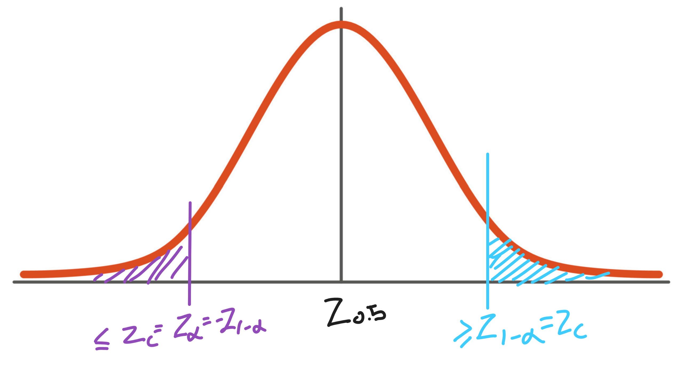
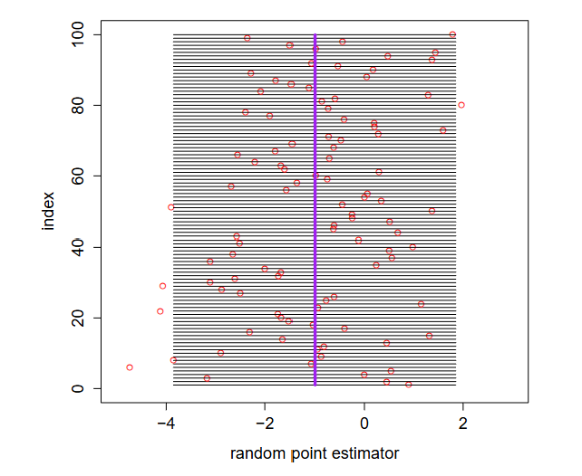
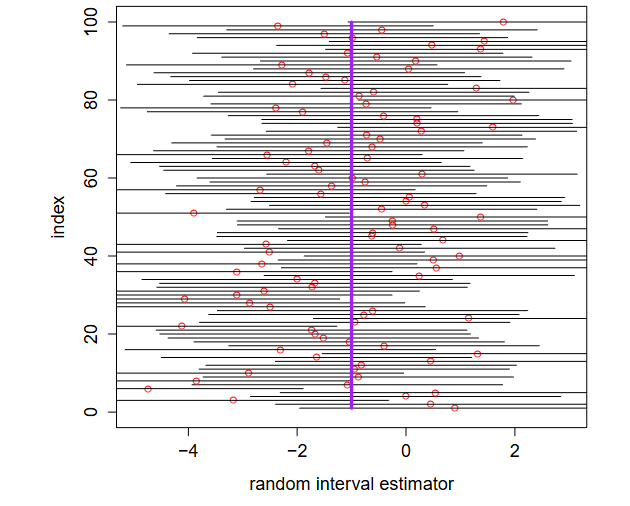

# Large Sample Size (Z- Distribution)

## CLT
CLT states that when sample size, $n$, is **large enough**, then for any iid $Y_{1}, Y_{2}, ..., Y_{n}$ with mean, $\mu$ and variance $\sigma^{2}$,

$$\bar{Y} \sim \mathcal{N}(\mu, \frac{\sigma^{2}}{n})$$

## Z Distribution
* The Z distribution is a standard normal distribution with mean 0 and variance 1.

### Derivation

* If $\hat{\theta}$ has a $\mathcal{N} (E[\hat{\theta}], Var(\hat{\theta} ) )$, then

$$\hat{\theta}  \sim \mathcal{N} (\theta, \sigma^{2}_{\hat{\theta}})$$

If we let the pivotal quantity have the form

$$Z \equiv \frac{\hat{\theta} - \theta}{\sigma_{\hat{\theta}}} \sim \mathcal{N}(0,1)$$

* Notice $Z \sim \mathcal{N}(0,1)$ does not depend on $\theta$
```math
E[Z] = E[\hat{\theta} - \theta] = E[\hat{\theta}] - E[\theta] = \theta - \theta = 0
```

```math
Var(Z) = Var(\frac{\hat{\theta} - \theta}{\sigma_{\hat{\theta}}}) =\frac{1}{\sigma_{\hat{\theta}}^{2}} Var(\hat{\theta}) = \frac{\sigma_{\hat{\theta}}^{2}}{\sigma_{\hat{\theta}}^{2}} = 1
```

## Confidence Intervals for $\theta$

| Target Parameter $\theta$ | Point Estimator $\hat{\theta}$ | $$\sim\mathcal{N}(\mu,\sigma^{2})$$ |
| :--- | :--- | :--- | 
| $\mu$ |   $\hat{\theta}=\bar{Y}$ |$$\mathcal{N}(\mu,\frac{\sigma^{2}}{n})$$  |
| $p$ | $\hat{\theta} =\hat{p}$ | $$\mathcal{N}(p,\frac{pq}{n})$$ | 
| $\mu_{1} - \mu_{2}$ | $$\hat{\theta} =\bar{Y}\_{1}-\bar{Y}\_{2} $$  | $$\mathcal{N}(\mu_{1}-\mu_{2},\frac{\sigma\_{1}^{2}}{n\_{1}}+\frac{\sigma\_{2}^{2}}{n\_{2}}) $$ |
| $p_{1} - p_{2} $ | $\hat{\theta}=\hat{p_{1}} - \hat{p_{2}}$ | $$\mathcal{N}(\hat{p}\_{1}-\hat{p}\_{2},\frac{p\_{1}q\_{1}}{n\_{1}}+\frac{p\_{2}q\_{2}}{n\_{2}})$$ | 


## Notations

$$
\begin{align*} 
& P(Z \geq z_{c}) = c \\
& P(Z \geq z_{1-\alpha}) = 1 - \alpha \\
& P(Z \geq z_{\alpha}) = \alpha \\
& P(Z \leq z_{\alpha}) = 1 - \alpha 
\end{align*}
$$

   


## Two sided confidence Intervals
Goal: Find $(\hat{\theta}_{L}, \hat{\theta}_{U})$
1. Use $Z=\frac{\hat{\theta}-\theta}{\sigma_{\hat{\theta}}}\sim\mathcal{N}(0,1)$ to find $z\_{\frac{\alpha}{2}}$ from the standard normal table s.t.

$$P(-z_{\frac{\alpha}{2}} \leq Z \leq z_{\frac{\alpha}{2}}) = 1 - \alpha$$

$$P(-z_{\frac{\alpha}{2}} \leq \frac{\hat{\theta}-\theta}{\sigma_{\hat{\theta}}} \leq z_{\frac{\alpha}{2}}) = 1 - \alpha$$

2. Rearranging the threshold, the two-sided confidence interval with confidence coefficient $1-\alpha$ becomes

$$(\hat{\theta}-z_{\frac{\alpha}{2}}\sigma_{\hat{\theta}},\hat{\theta}+z_{\frac{\alpha}{2}}\sigma_{\hat{\theta}})$$

## One Sided Upper Bound
* Goal: Find $(-\infty, \hat{\theta}_{U}]$
1. Use $Z=\frac{\hat{\theta}-\theta}{\sigma_{\hat{\theta}}}\sim\mathcal{N}(0,1)$ to find $z\_{1-\alpha}$ from the standard normal table s.t.

$$
\begin{align*} 
P(Z \geq z_{1 - \alpha}) & = 1 - \alpha   \\
& \Rightarrow P(Z \geq z_{1 - \alpha})  \\ 
& \Rightarrow P\bigg( \frac{\hat{\theta} - \theta}{\sigma_{\hat{\theta}}} \geq -z_{\alpha} \bigg)  \\
& \Rightarrow P(\hat{\theta} + z_{\alpha} \sigma_{\hat{\theta}} \geq \theta) = 1 - \alpha
\end{align*}
$$

* The one sided upper bound confidence interval with confidence coefficient $1- \alpha$ becomes

$$ (-\infty, \hat{\theta} + z_{\alpha} \sigma_{\hat{\theta}}]$$


## One Sided Lower Bound
* Goal: Find $[-\hat{\theta}_{U}, \infty]$
1. Use $Z=\frac{\hat{\theta}-\theta}{\sigma_{\hat{\theta}}}\sim\mathcal{N}(0,1)$ to find $z\_{\alpha}$ from the standard normal table s.t.

$$
\begin{align*} 
P(Z \leq z_{1 - \alpha}) & = 1 - \alpha   \\
& \Rightarrow P\bigg( \frac{\hat{\theta} - \theta}{\sigma_{\hat{\theta}}} \leq z_{\alpha} \bigg) \\
& \Rightarrow P(\hat{\theta} - z_{\alpha} \sigma_{\hat{\theta}} \leq \theta) = 1 - \alpha
\end{align*}
$$

* The one sided lower bound confidence interval with confidence coefficient $1- \alpha$ becomes

$$ [\hat{\theta} - z_{\alpha} \sigma_{\hat{\theta}}, \infty)$$


## Interpretation of Confidence Intervals

|Incorrect Interpretation|Correct Interpretation|
 |:--- |:---- |
 |The true parameter will **fall into** the resulting C.I. [0.1451, 0.2251] with probability 95% | If we repeatedly collect samples out of the population, 95% of times the resultant confidence intervals will **cover** the true parameter.| 
 ||If you we have 100 samples taken out the population. Each sample, we will have an confidence interval, thus we have 100 different confidence intervals with 95% confidence coefficient. Then 95 out of 100 confidence intervals will actually **cover** the true parameter.|
 *  Reason: Sounds like the true parameter is some random variable


## Define: $( \theta \pm \sigma_{\hat{\theta}})$

   

* Purple Line: $\theta$
    * Fixed point
    * Interval fixed range (for $\theta$)
* Red Circles: $\hat{\theta}$ (Parameter of interest)
* The chances that $\hat{\theta}$ will **fall into** the interval $(\theta \pm  \sigma_{\hat{\theta}})$ 

## Define $( \hat{\theta} \pm \sigma_{\hat{\theta}})$



* Purple Line: $\theta$ (Parameter of interest)
    * Fixed point
* Interval fixed range (for $\hat{\theta}$)
* Red Circles: $\hat{\theta}$ 
* The chances that the interval $(\hat{\theta} \pm  \sigma_{\hat{\theta}})$  will **cover** $\theta$ 