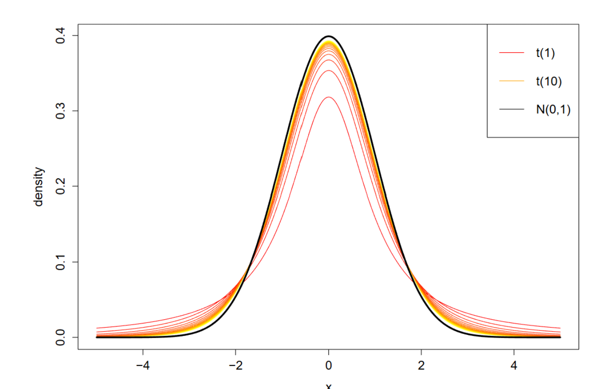
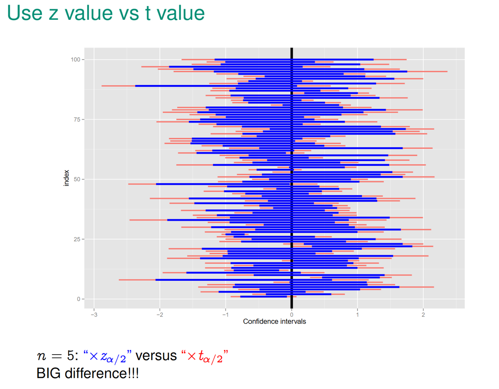
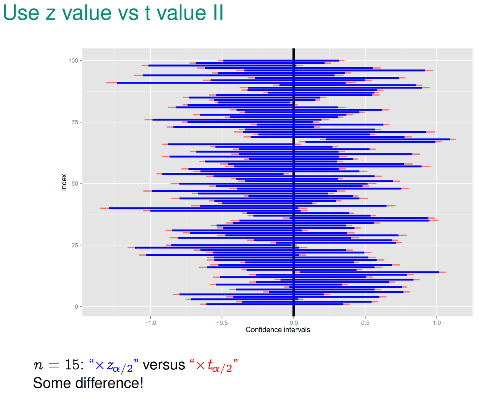
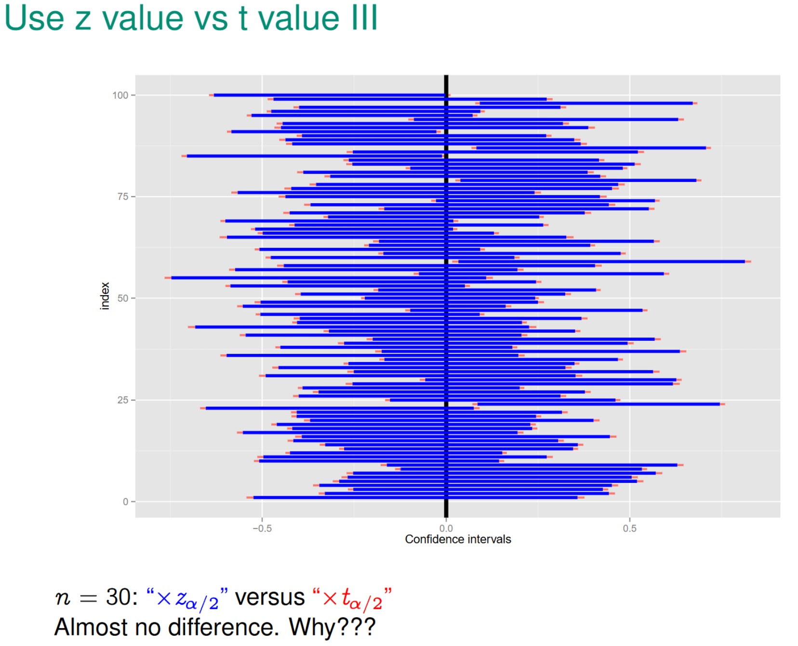

# Small Sample Size (t- distribution)

## Problem
* Recall: Central Limit Theorem only applies if $n$ is large enough.
* For a large $n$ we used $S^{2}$ (sample variance) as an approximate for the population $\sigma^{2}$, but the variance behavior is more random and less reliable for a small sample
    * For a small sample uncertainity of $S^{2}$ needs to be considered

## $t$-Distribution
* If $n$ is small, we use the $t$-distribution instead of the normal distribution.

$$T =  \frac{\overline{Y} - \mu }{\sigma_{\overline{Y}}} = \frac{\overline{Y} = \mu}{\frac{S}{\sqrt{n}}} \sim t(n-1)$$

> T has $t$-distribution with degrees of freedom $\text{d}f=n-1$

### Confidence Intervals

* 2 sided Confidence Intervals for $\mu$ 

$$[\overline{Y}-t\_{\frac{\alpha}{2}}\sigma_{\overline{Y}},\overline{Y}+t\_{\frac{\alpha}{2}}\sigma\_{\overline{Y}}]$$

* 1-sided Upper Bound Confidence Interval for $\mu$

$$ (-\infty,\overline{Y}+t\_{\alpha}\sigma\_{\overline{Y}}]$$
* 1-sided Lower Bound Confidence Interval for $\mu$

$$[\overline{Y}-t\_{\alpha}\sigma\_{\overline{Y}},\infty)$$

## Construction of $t$ distribution

> Let $U_{1}, ... , U_{v} \sim \mathcal{N}(0,1)$. If $X \equiv U_{1}^{2} + ... + U_{v}^{2}$, then X follows $\chi^{2}$ distribution with $v$ degrees of freedom

Suppose $Z \sim \mathcal{N}(0,1)$ and $X \sim \chi^{2}(v), Z \bot X$, then 

$$T \equiv \frac{Z}{\sqrt{\frac{X}{v}}}$$

* $T$ is said to follow $t$-distribution with $v$ degrees of freedom
$T \sim t(v)$

### Pivotal Quantity for $t$-distribution 
Recall:
1. If $Y_{i}$ iid and $Y\_{i} \sim \mathcal{N}(\mu\_{Y}, \sigma^{2}\_{Y})$ then $\frac{ \overline{Y} - \mu\_{Y}}{\frac{\sigma\_{Y}}{\sqrt{n}}} \sim N(0,1)$

2. If $Y_{i} \sim \mathcal{N}(\mu, \sigma^{2})$ and $Y_{i} \sim$ iid, then

$$ \frac{(n-1)S^{2}}{\sigma^{2}} = \frac{1}{\sigma^{2}} \sum\limits_{i=1}^{n}(Y_{i} - \overline{Y})^{2} \sim \chi^{2}(n-1)$$

3. $\overline{Y} \bot S^{2}$
Then

$$T\equiv\frac{Z}{\sqrt{\frac{X}{v}}}= \frac{\frac{ \overline{Y} - \mu\_{Y}}{\frac{\sigma\_{Y}}{\sqrt{n}}}}{\sqrt{\frac{\frac{(n-1)S^{2}}{\sigma\_{Y}^{2}}}{n-1}}}=\frac{\overline{Y} -\mu\_{Y}}{\frac{S}{\sqrt{n}}} \sim t(n-1)$$

> $Z\bot X$ means $Z$ and $X$ and independent

> iid = independent identically distributed

## Properties of $t$ distribution

* $t(v)$ is close to $\mathcal{N}(0,1)$ for a large $v$
    * As the degree of freedom increases $t$ distribution approaches $\mathcal{N}(0,1)$
* PDF symmetric (like normal distribution)
*  $t$ distribution has a fatter tail. (more chances for extreme values)

## Z vs T statistics

| Distribution | Z Distribution | T distribution |
| --- | --- | --- |
| | $$Z\equiv\frac{\overline{Y}-\mu_{Y}}{\frac{\sigma_{Y}}{\sqrt{n}}}\sim\mathcal{N}(0,1)$$ | $$T\equiv\frac{\overline{Y}-\mu_{Y}}{\frac{S}{\sqrt{n}}}\sim\mathcal{t}(n-1)$$ |
|Conditions | <ul> <li> More commonly if $n$ is large, regardless of distribution or $Y_{i}\sim\mathcal{N}(\mu,\sigma^{2})$ regardless of $n$</li> <li>$\sigma_{Y}$ is available/defined </li></ul> | <ul><li>$Y_{i}\sim\mathcal{N}$ regardless of $n$.</li> <li> $\sigma_{Y}$ not defined/available</li></ul> |
* $Z$ distribution only applicable if standard deviation of popultation ($\sigma$) is known.
    * $n$ is large $\rightarrow S$ approaches $\sigma$
    * $n$ is small, the deviation of $S$ from $\sigma$ cannot be ignored and needs to be considered 

### Visual of Z vs t distribution

* For small $n$, $z$ distributions fails to deliver promosied converage probability
* For large $n$, $z$ distributions delivers promosied converage probability
    * $n=30$ difference becomes minimal

## Confidence Interval for large $\mu_{1} - \mu_{2}$

Recall when $\theta = \mu_{1}-\mu_{2}$, we used $\hat{\theta}=\overline{Y}_{1}-\overline{Y}_{2}$ as an unbiased estimator.

* If $n$ is large

$$\overline{Y}\_{1}-\overline{Y}\_{2}\sim\mathcal{N}(\mu\_{1}-\mu\_{2}, \sigma\_{\overline{Y}\_{1} - \overline{Y}\_{2}}) \text{ where } \sigma_{\overline{Y}\_{1} - \overline{Y}\_{2}} = \sqrt{\frac{\sigma_{2}^{2}}{n\_{1}} + \frac{\sigma_{2}^{2}}{n\_{2}}} \approx \sigma\sqrt{\frac{1}{n\_{1}} + \frac{1}{n\_{2}}}$$

> For simplicity assume $\sigma_{1}^{2}=\sigma_{2}^{2}=\sigma^{2}$

then the pivotal quantity,

$$Z=\frac{\overline{Y}\_{1}-\overline{Y}\_{2}-(\mu\_{1}-\mu\_{2})}{\sigma\_{\overline{Y}\_{1}-\overline{Y}\_{2}}}=\frac{\overline{Y}\_{1}-\overline{Y}\_{2}-(\mu\_{1}-\mu\_{2})}{\sigma\sqrt{\frac{1}{n\_{1}}+\frac{1}{n\_{2}}}}=\mathcal{N}(0,1)$$

### Confidence Interval
* 2 sided Confidence Intervals for $\mu$ 

$$[\overline{Y}\_{1}-\overline{Y}\_{2}z\_{\frac{\alpha}{2}}\sigma\_{\overline{Y}\_{1}-\overline{Y}\_{2}},\overline{Y}\_{1}+\overline{Y}\_{2}z\_{\frac{\alpha}{2}}\sigma\_{\overline{Y}\_{1}-\overline{Y}\_{2}}]$$

* 1-sided Upper Bound Confidence Interval for $\mu$

$$ (-\infty,\overline{Y}\_{1}+\overline{Y}\_{2}z\_{\alpha}\sigma\_{\overline{Y}\_{1}-\overline{Y}\_{2}}]$$

* 1-sided Lower Bound Confidence Interval for $\mu$

$$[\overline{Y}\_{1}-\overline{Y}\_{2}z\_{\alpha}\sigma\_{\overline{Y}\_{1}-\overline{Y}\_{2}},\infty)$$

## Confidence Interval for small $\mu$

### Differences from large $\mu_{1} - \mu_{2}$
* Smaller sample size, $n$
* Population variance, $\sigma^{2}$ is unknown and cannot be assumed
    * $\sigma^{2}$ is estimated by the pooled sample variance $S\_{p}^{2}$

$$
\begin{align*}
S^{2}\_{p} &\equiv\frac{\sum\limits_{i=1}^{n\_{1}}(Y\_{1\_{i}}- \overline{Y}\_{1})^{2} + \sum\limits_{i=1}^{n\_{2}} (Y\_{2\_{i}}- \overline{Y}\_{2})^{2} }{n\_{1}+ n\_{2}-2} \\
&=\frac{(n\_{1} - 1)S^{2}\_{1} + (n\_{2} - 1)S^{2}\_{2}}{n\_{1}+ n\_{2}-2}
\end{align*}
$$
### Pivotal Quantity

When the sample size $n$ is small and $\sigma$ is repalced with $S\_{p}$ the pivotal quantity becomes

$$T=\frac{\overline{Y}\_{1}-\overline{Y}\_{2}-(\mu\_{1}-\mu\_{2})}{\sigma\_{\overline{Y}\_{1}-\overline{Y}\_{2}}}=\frac{\overline{Y}\_{1}-\overline{Y}\_{2}-(\mu\_{1}-\mu\_{2})}{S\_{p}\sqrt{\frac{1}{n\_{1}}+\frac{1}{n\_{2}}}}\sim t(n\_{1}+n\_{2}-2)$$

* T has a $t$ distribution with $\text{d}f=n_{1}+ n_{2}-2$ 

### Confidence Intervals

* 2 sided Confidence Intervals for $\mu$ 

$$[\overline{Y}\_{1}-\overline{Y}\_{2}t\_{\frac{\alpha}{2}}\sigma\_{\overline{Y}\_{1}-\overline{Y}\_{2}},\overline{Y}\_{1}+\overline{Y}\_{2}t\_{\frac{\alpha}{2}}\sigma\_{\overline{Y}\_{1}-\overline{Y}\_{2}}]$$

* 1-sided Upper Bound Confidence Interval for $\mu$

$$ (-\infty,\overline{Y}\_{1}+\overline{Y}\_{2}t\_{\alpha}\sigma\_{\overline{Y}\_{1}-\overline{Y}\_{2}}]$$

* 1-sided Lower Bound Confidence Interval for $\mu$

$$[\overline{Y}\_{1}-\overline{Y}\_{2}t\_{\alpha}\sigma\_{\overline{Y}\_{1}-\overline{Y}\_{2}},\infty)$$

### Notes

* If we use $\sqrt{\frac{S^{2}\_{1}}{n\_{1}}+\frac{S^{2}\_{2}}{n\_{2}}}$, then the degree of freedom becomes a very complicated formula. (Possible to find distribution).
    * That is, we assume $\sigma\_{\overline{Y}\_{1}}\neq\sigma\_{\overline{Y}\_{2}}$