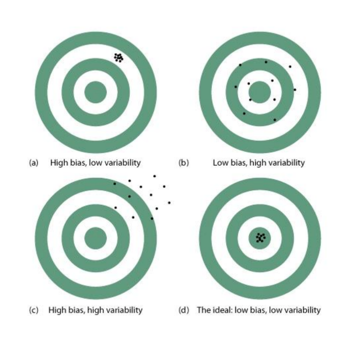

# Point Estimators

## Terms and Definition
* Population: Total Set of all Subjects of interest
* Sample: subset of population with data/plan to collect
* Subject: unit we observer/measure
* Variable: Measurement of certain characteristic of a subject
    * varies from subject to subject (random variable)
* Parameter: Characterization of the distribution of the variable
    * Unknown but can be inferred
    * Example $$\mu$$ 

## Estimator and estimate
* Estimator: rule/formula that tells us how to use sample data to predict parameter
    * $$\bar{X} = \frac{1}{n} \sum\limits_{i=1}^{n} X_{i}$$ 
        * \bar{X} is a r.v.
* Estimate: value produced by the estimator

* **Universal Notation**
    * Parameter to be estimated: $\theta$
    * Estimator: $\hat{\theta}$
        * Note: If $\theta$ is a r.v., then $\hat{\theta}$ is a r.v.
        * $\hat{\theta}$ has a distribution

## Bias and Variability
    

* Good Estimator: Low bias and Low Variance
* $$Bias(\hat{\theta}) = E[\hat{\theta}] - \theta $$
    * An estimator, $\hat{\theta}$, is **unbiased** if $Bias(\hat{\theta}) = 0$ or $E[\hat{\theta}] = \theta$

* Variance: more stable performance

